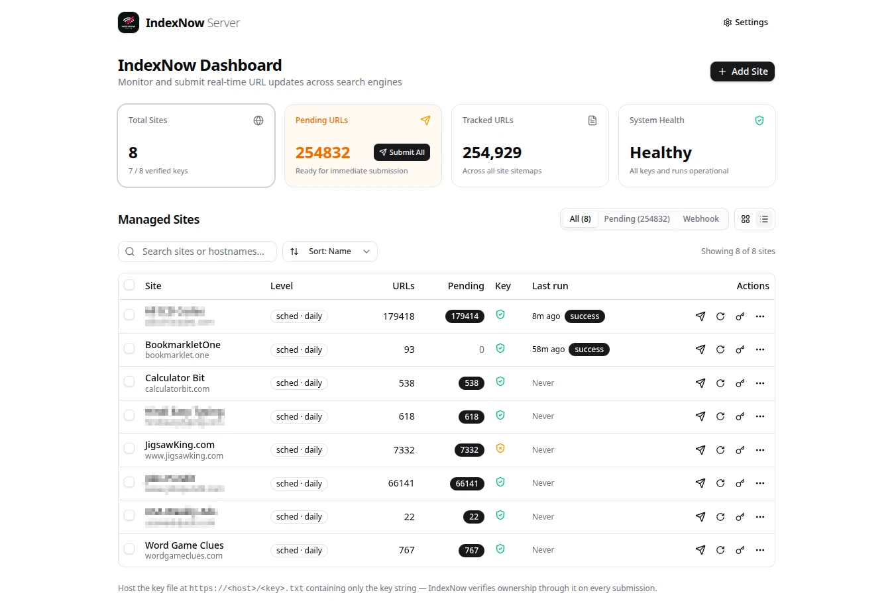
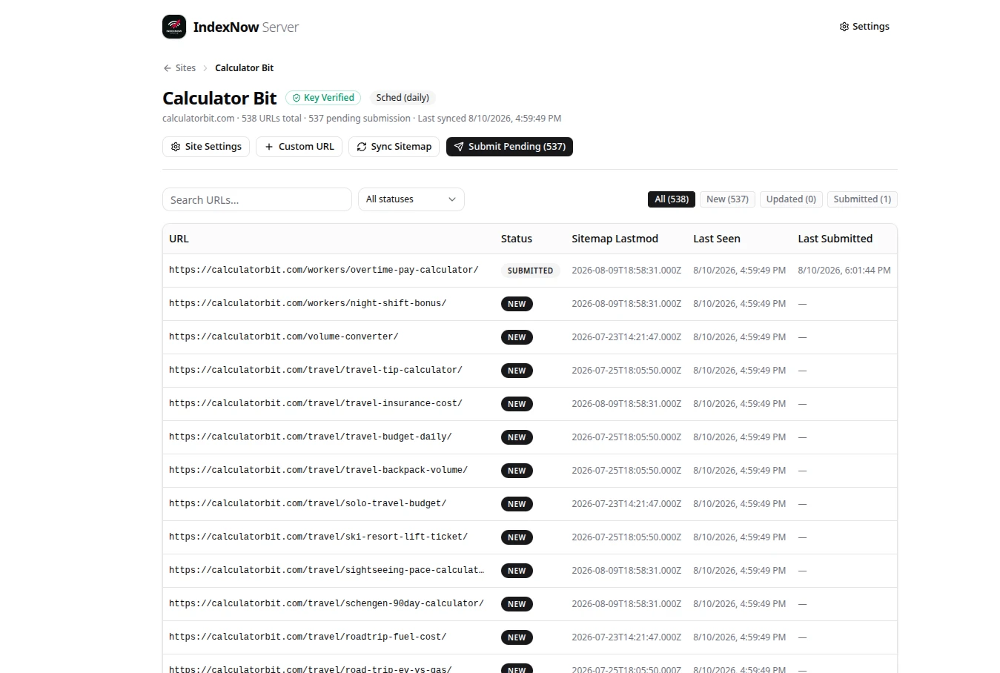
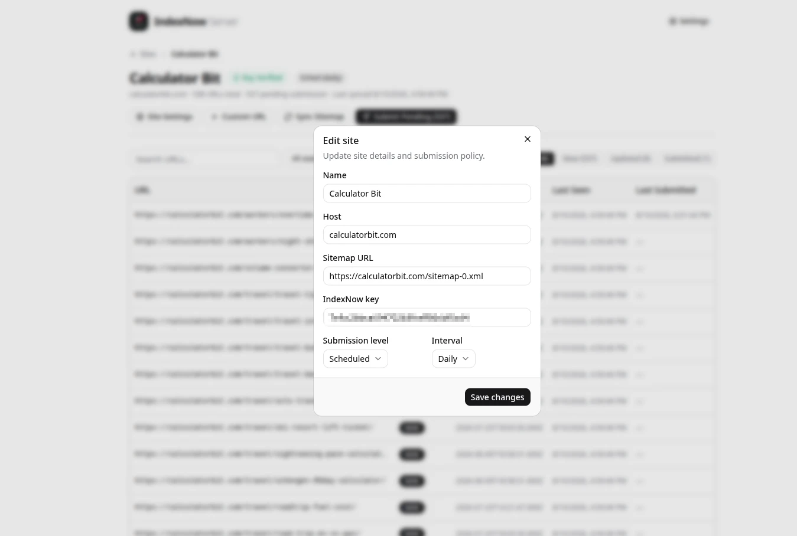
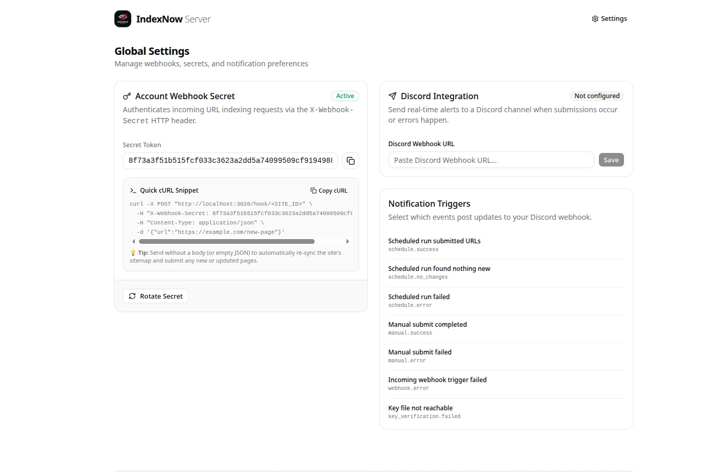
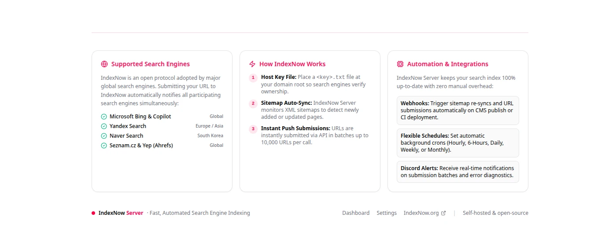

# IndexNow Server

[](https://github.com/TheTechBasket/index-now-server/releases)
[](LICENSE)
[](https://nodejs.org)
[](https://github.com/TheTechBasket/index-now-server/pkgs/container/index-now-server)

Self-hosted dashboard for managing [IndexNow](https://www.indexnow.org/) submissions across multiple sites. Handles keys, sitemaps, and submission scheduling from one place — pushes to Bing, Yandex, and every other participating engine via `api.indexnow.org`.



<details>
<summary>More screenshots</summary>

**URL list & site detail**


**Edit site dialog**


**Settings page**


**Login page**


</details>

## Features

- **Multi-site** — add sites, generate/rotate IndexNow keys, bulk Submit / Sync / Verify / Delete
- **Sitemap diffing** — fetches sitemaps, submits only new or changed URLs, batches up to 10,000 per request
- **Three submission modes per site** — `manual` (dashboard button), `scheduled` (hourly / 6 h / daily cron), or `webhook` (`POST /hook/:siteId` from your CMS or build pipeline)
- **Key file helper** — copy or download the exact `<key>.txt` content directly from the dashboard
- **Discord notifications** — optional webhook with per-event toggles and a test button
- **Simple auth** — optional login gate via `ADMIN_EMAIL` / `ADMIN_PASSWORD`. Set `AUTH_ENABLED=false` to skip entirely
- **One process** — Fastify serves the API and React dashboard on a single port. SQLite, no external services

## Quick start

```bash
pnpm install
pnpm dev          # http://localhost:3020
```

Add a site, host the generated key file at `https://<your-domain>/<key>.txt`, then submit.

## Auth

Set `ADMIN_EMAIL`, `ADMIN_PASSWORD`, and `AUTH_SECRET` in `.env` to enable the login gate. Leave them empty or set `AUTH_ENABLED=false` to run without auth. Changing credentials never affects your stored sites or URLs.

## Production

```bash
pnpm build
AUTH_SECRET=$(openssl rand -base64 32) pnpm start
```

See [`.env.example`](.env.example) for all options. The SQLite database lives at `./data/indexnow.db` — back that file up and you've backed up everything.

## Docker

No clone needed — pulls the published image directly.

**`docker run`**

```bash
docker run -d \
  --name indexnow-server \
  --restart unless-stopped \
  -p 3020:3020 \
  -v indexnow-data:/app/data \
  -e AUTH_SECRET=$(openssl rand -base64 32) \
  -e ADMIN_EMAIL=admin@example.com \
  -e ADMIN_PASSWORD=your-strong-password \
  ghcr.io/thetechbasket/index-now-server:latest
```

**`docker compose`**

```bash
curl -O https://raw.githubusercontent.com/TheTechBasket/index-now-server/main/docker-compose.yml
AUTH_SECRET=$(openssl rand -base64 32) \
  ADMIN_EMAIL=admin@example.com \
  ADMIN_PASSWORD=your-strong-password \
  docker compose up -d
```

Open `http://your-server:3020` and sign in. To skip the login gate entirely, drop the `AUTH_SECRET`/`ADMIN_*` vars and add `-e AUTH_ENABLED=false` (or `AUTH_ENABLED=false` before `docker compose up -d`).

To build from source instead of pulling, clone the repo and edit `docker-compose.yml` per the comment at the top of the `indexnow-server` service.

## Stack

Fastify · Drizzle + better-sqlite3 · React + shadcn/ui + Tailwind v4 · node-cron

```
src/server/   Fastify, auth, Drizzle schema, submission engine, cron
src/client/   React SPA (Vite)
drizzle/      SQL migrations (applied automatically at boot)
```

## Contributing

PRs welcome — see [CONTRIBUTING.md](CONTRIBUTING.md). Run `pnpm exec tsc --noEmit && pnpm build` before pushing.

## Security

See [SECURITY.md](SECURITY.md). Do not open a public issue for security problems.

## License

[MIT](LICENSE)
